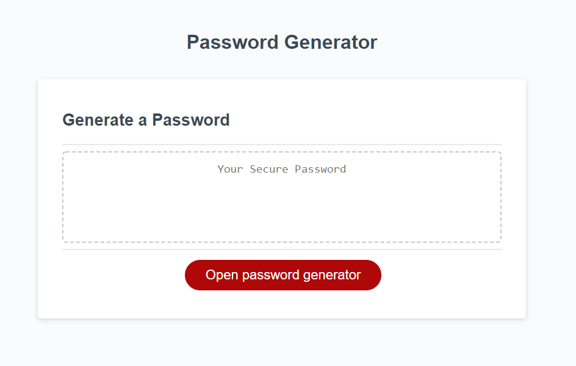
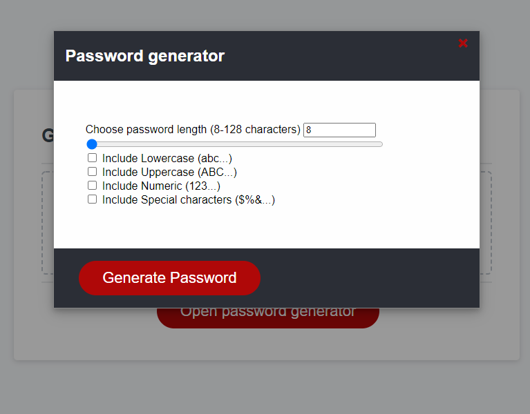

<h1> Password Generator </h1>

 The Application is composed of two components, a main page and a modal dialog. The main page contains a Textbox to hold the generated password and a button to open the password generator modal. The modal dialog contains several inputs for the user to choose the password lenght and the types of characters to use as well as a button to generate the password.
After pressing on the Generate password button, the modal dialog close and the password is displayed in the main page textbox.

<h1> Screenshots </h1>

 Main Page 

 Password Generator - Modal dialog 

